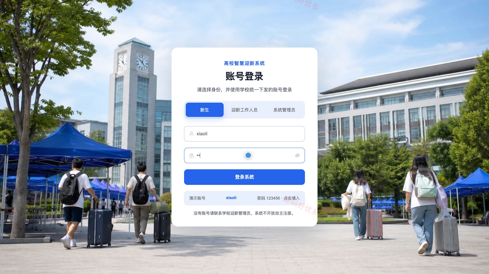
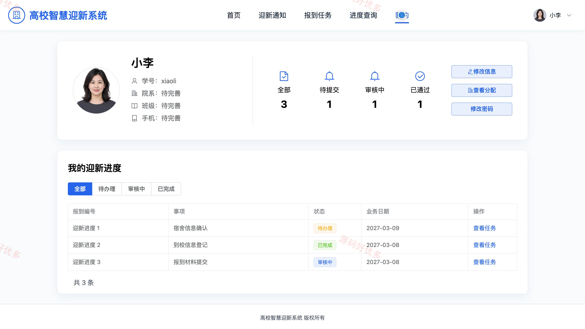
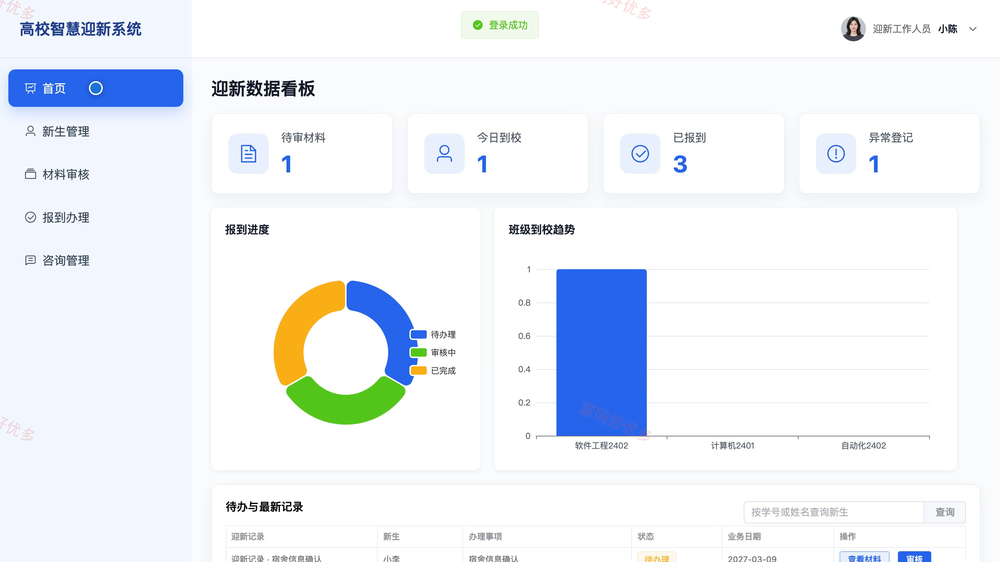
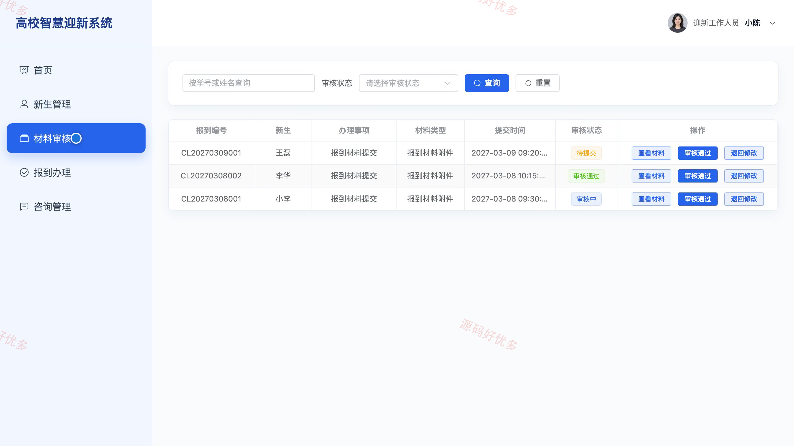
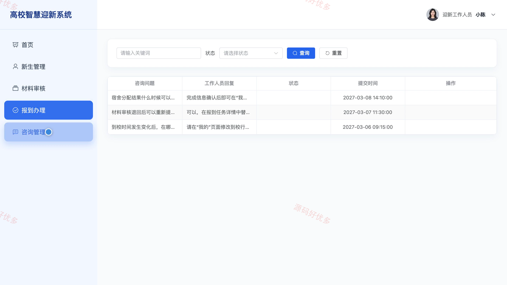
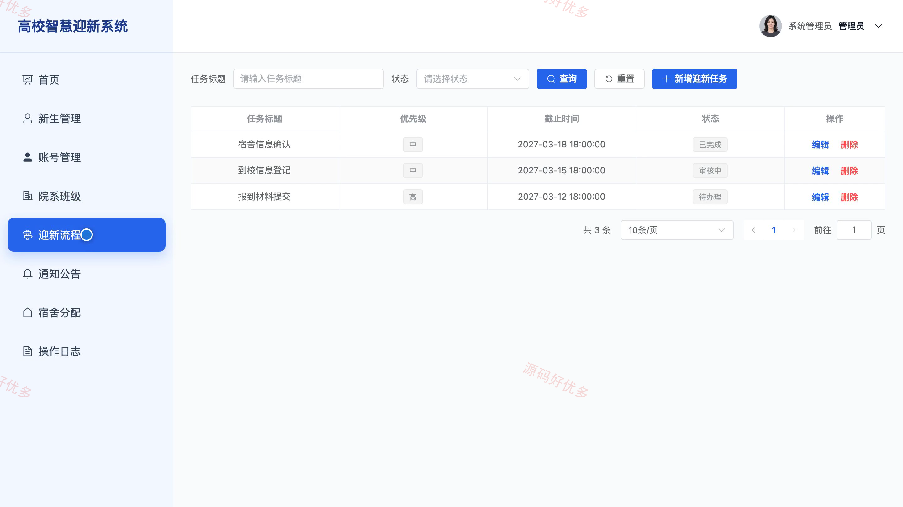

# bs083A
bs083A高校智慧迎新系统
## 源码问题查看主页咨询

### 一、关键词
高校迎新、入学报到、新生服务、材料审核、宿舍分配

### 二、作品包含
源码+数据库+万字设计文档+PPT+全套环境和工具资源+本地部署教程

### 三、项目技术
前端技术： Html、Css、Js、Vue3.4、Element-Plus
后端技术：Java、SpringBoot3.2.0、MyBatis-Plus

### 四、运行环境（以下版本亲测，其他版本兼容性请自行测试）
开发工具：IDEA/eclipse + VSCODE

数据库：MySQL5.7+（共13张表）

数据库管理工具：Navicat10以上版本

环境配置软件： JDK17 + Maven

前端Nodejs：16+

浏览器：谷歌浏览器

### 五、项目介绍
项目编号：bs083A

系统面向高校新生报到业务，将迎新通知、报到任务、材料提交与审核、报到进度、宿舍分配和咨询服务集中在同一平台。新生可在前台查看通知与任务、上传报到材料并跟踪办理进度；迎新工作人员处理新生档案、材料审核、报到办理与咨询；系统管理员维护账号、院系班级、迎新流程、通知公告和宿舍信息。

角色：新生、迎新工作人员、系统管理员

新生功能：迎新通知查看、报到任务查看、报到材料上传、办理进度查询、宿舍分配查看、迎新咨询提交、个人信息维护、登录密码修改。

迎新工作人员功能：迎新数据统计、新生档案管理、报到材料审核、报到办理登记、新生咨询处理、个人资料维护。

系统管理员功能：迎新数据统计、新生档案管理、账号信息管理、院系班级管理、迎新流程管理、通知公告管理、宿舍分配管理、操作日志查看。

### 六、运行截图

